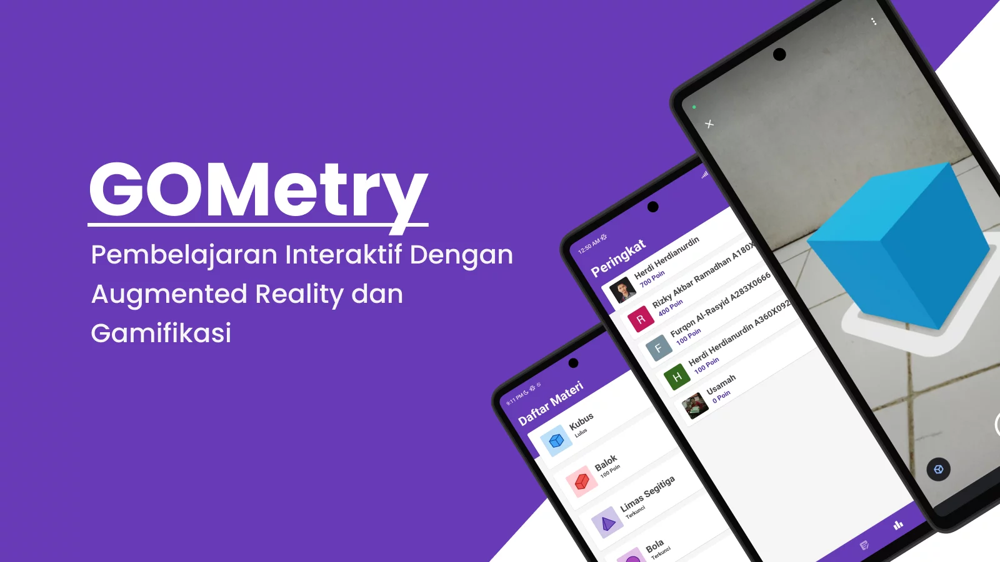

## Capstone Project


**GOMetry** adalah aplikasi pembelajaran bangun ruang interaktif dengan menggunakan teknologi **Augmented Reality** dan konsep **Gamifikasi**. Proyek ini dibuat oleh **Tim C22-218** untuk memenuhi proyek akhir SIB Dicoding Batch 3. Berikut adalah daftar anggota **Tim C22-218**:
  - Furqon Al-Rasyid
  - Herdi Herdianurdin
  - Rizky Akbar Ramadhan
  - Ahmad Usamah Ali

### Struktur JSON Realtime Database
```JSON
{
  "users": {
    "userId": {
      "achievements": ["beginner", "skilled", "proficient"],
      "displayName": "John Doe",
      "email": "john@mail.com",
      "geometries": ["cube", "beam", "triangular_pyramid", "ball", "cone", "tube", "triangular_prism"],
      "id": "userId",
      "photoUrl": "https://upload.wikimedia.org/wikipedia/commons/thumb/5/50/John_and_Jane_Doe_Headstones.jpg/1200px-John_and_Jane_Doe_Headstones.jpg",
      "point": 700
    }
  },
  "questions": {
    "questionId": {
      "anwer": "Kubus",
      "geometryId": "cube",
      "image": "cube-1.webp",
      "level": "beginner",
      "option": ["Balok", "Prisma", "Tabung", "Kubus"],
      "question": "Apa nama bangun ruang tersebut?"
    }
  }
}
```

### Dibuat Dengan
[](https://kotlinlang.org/)
[](https://firebase.google.com/)
[](https://developers.google.com/ar)

## License
Distributed under the MIT License. See [LICENSE](LICENSE) for more information.
